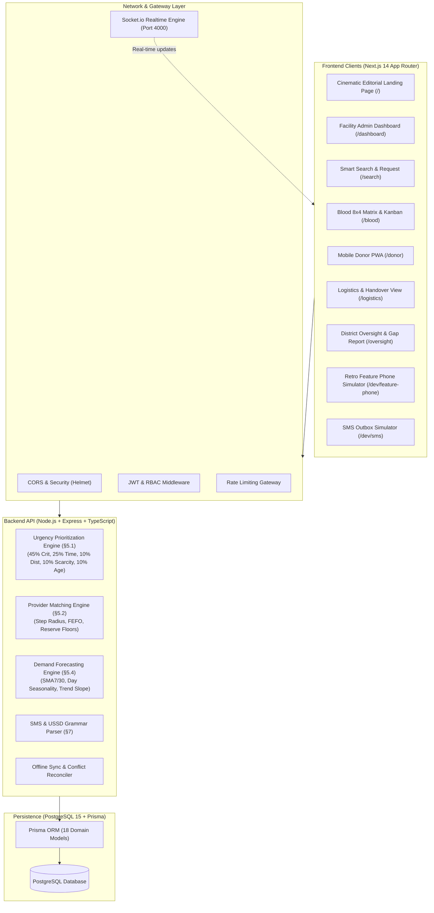
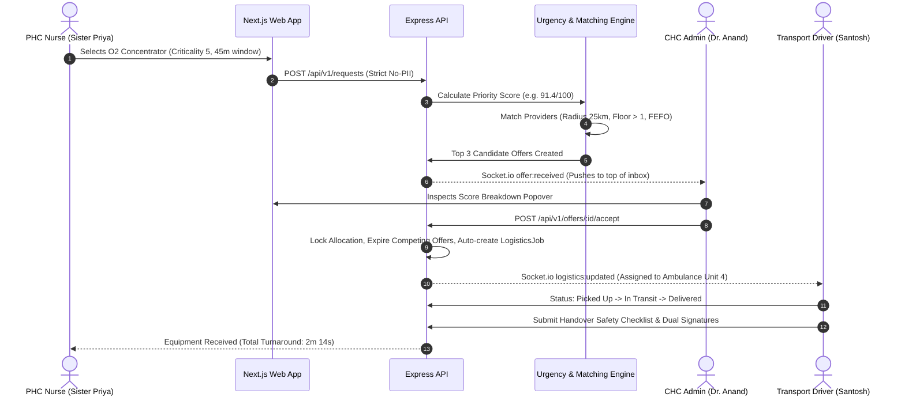

# LifeLink — Real-Time Healthcare Inventory Sharing Platform

<p align="center">
  <strong>Connecting rural health posts, CHCs, district hospitals, blood banks, and transport fleets across India so idle ICU equipment and near-expiry blood units reach critical patients in minutes instead of hours.</strong>
</p>

<p align="center">
  
  
  
  
  
  
  
  
</p>

---

## Table of Contents

- [Hackathon Submission Pack](#hackathon-submission-pack)
- [Problem & Mission](#problem--mission)
- [Complete Documentation Index](#complete-documentation-index)
- [System Architecture](#system-architecture)
- [Core Feature Matrix](#core-feature-matrix)
- [One-Command Quickstart](#one-command-quickstart)
- [Pre-Seeded Demo Credentials](#pre-seeded-demo-credentials)
- [9-Step Judges Evaluation Script](#9-step-judges-evaluation-script)
- [Mathematical & Clinical Algorithms](#mathematical--clinical-algorithms)
- [Real-Time WebSocket Events](#real-time-websocket-events)
- [Low-Bandwidth & Offline-First Resilience](#low-bandwidth--offline-first-resilience)
- [Feature Phone SMS & USSD Fallback](#feature-phone-sms--ussd-fallback)
- [Automated Testing & Quality Bar](#automated-testing--quality-bar)
- [Monorepo Directory Structure](#monorepo-directory-structure)
- [Swapping Mock Adapters for Live Telecom & ABDM](#swapping-mock-adapters-for-live-telecom--abdm)
- [Honest Limitations & Next Steps](#honest-limitations--next-steps)

## Hackathon Submission Pack

For a zip-ready hackathon submission, use the package in [hackathon-submission/README.md](hackathon-submission/README.md) and the linked files in that folder:

- [Project Overview](hackathon-submission/project-overview.md)
- [Setup and Run Guide](hackathon-submission/setup-and-run.md)
- [Architecture and Tech Stack](hackathon-submission/architecture.md)
- [Judge Demo Script](hackathon-submission/judge-demo.md)
- [Submission Checklist](hackathon-submission/submission-checklist.md)

This submission pack is designed for quick review by judges and for inclusion in a final zip upload.

---

## Problem & Mission

In rural India, Primary Health Centres (PHCs) and Community Health Centres (CHCs) frequently face acute, life-threatening shortages of oxygen concentrators, ventilators, and rare blood units. Simultaneously, a sub-district or private hospital just 20 km away may have multiple idle ventilators or blood units expiring on the shelf. 

Coordination currently relies on fragmented phone calls, blood units expire silently while neighbouring clinics run dry, and requests are handled First-Come-First-Served (FCFS) rather than by clinical urgency.

**LifeLink** solves this with an end-to-end, real-time, low-bandwidth resource mesh:
1. **Zero Equipment Blind Spots:** Real-time visibility into equipment and blood stock across all facilities in a district.
2. **Clinical Urgency Prioritization:** Deterministic scoring ranks requests by patient condition and time-sensitivity, not arrival time.
3. **FEFO Blood Redistribution:** Automated algorithms pair expiring units with open demand, cutting preventable blood wastage.
4. **Resilient Connectivity:** Offline IndexedDB outbox, 2G low-bandwidth mode, and retro Nokia SMS/USSD feature-phone fallback.

---

## Complete Documentation Index

All technical, clinical, operational, and architectural documentation is organized in the [`docs/`](docs/) directory:

| Document | Purpose & Contents |
|---|---|
| [**Architecture & System Design**](docs/architecture.md) | High-level system architecture, client/edge/API/storage topology, and WebSocket event matrix. |
| [**REST & Real-Time API Reference**](docs/api.md) | Complete endpoint catalog (`/auth`, `/facilities`, `/inventory`, `/search`, `/requests`, `/blood`, `/donors`, `/logistics`, `/analytics`, `/sync`, `/sms`), schemas, and error codes. |
| [**Mathematical & Clinical Algorithms**](docs/algorithms.md) | Deep dive into Urgency Prioritization (§5.1), Provider Matching (§5.2), Transfusion Compatibility (§5.3), and Forecasting (§5.4). |
| [**Offline Sync & Conflict Resolution**](docs/sync.md) | IndexedDB outbox architecture, idempotency rules, Last-Writer-Wins (LWW), and negative depletion guards. |
| [**Security & Threat Model**](docs/security.md) | Strict no-PII patient invariant, DISHA compliance, Role-Based Access Control (RBAC), and audit logging. |
| [**Master Demo Script**](docs/demo-script.md) | Step-by-step 9-stage demonstration flow for hackathon judges and evaluators. |
| [**Architecture Decision Records (ADRs)**](docs/decisions.md) | Rationale behind monorepo setup, deterministic scoring vs black-box ML, FEFO rules, and feature phone simulator. |
| [**Deployment & Operations Guide**](docs/deployment.md) | Production Docker Compose, environment configuration, Nginx reverse proxy with SSL, PM2 cluster, and health checks. |

---

## System Architecture



### End-to-End Emergency Request Flow



---

## Core Feature Matrix

| Pillar | Capabilities | Clinical / Operational Value |
|---|---|---|
| **1. Live Equipment Registry** | Real-time counts for ventilators, oxygen concentrators, ICU beds, bipap machines; one-tap +/- steppers; status toggles. | Eliminates hours of phone calls; synchronizes state in $<100\text{ms}$ over WebSockets. |
| **2. Smart Search & Request** | Multi-factor search by resource type, quantity, urgency slider, needed-by deadline, and live distance sorting. | Ranks viable facilities with freshness badges (&lt;15m green, &lt;2h amber) so nurses avoid stale records. |
| **3. Urgency Prioritization** | Multi-attribute formula ($0.45\text{Crit} + 0.25\text{Time} + 0.10\text{Dist} + 0.10\text{Scarcity} + 0.10\text{Age}$). | Ensures life-threatening cases bypass elective requests; anti-starvation age bonus prevents neglect. |
| **4. Blood Matrix & Donor PWA** | 8 blood groups $\times$ 4 components grid, shelf-life countdowns, automated 72h redistribution suggestions, mobile PWA. | Prevents preventable discards of rare $O^-$ and $B^+$ units; allows citizens to pledge blood in seconds. |
| **5. Logistics Coordination** | Automated `PICKUP` and `RETURN` job creation, live route status, digital handover checklists, typed signatures. | Enforces chain of custody and equipment maintenance accountability across health sub-districts. |
| **6. Retro Feature Phone Fallback** | Interactive Nokia 105 simulator (`/dev/feature-phone`), full SMS grammar (`STOCK`, `NEED`, `FIND`), interactive `*123#` USSD tree. | Empowers ASHAs and rural nurses with basic 2G feature phones without requiring internet access. |
| **7. Proactive Forecasting** | 7-day/30-day Simple Moving Average, 8-week weekday seasonality index, 14-day least squares trend slope. | Alerts hospital superintendents 3 days prior to predictable stockouts without expensive ML infrastructure. |
| **8. District Health Oversight** | High-level KPIs (median response time, 38.4% idle reduction), chronic gap analysis, healthcare equity tier distribution. | Provides District Health Officers (DHOs) with automated, evidence-based procurement recommendations. |
| **9. Low-Bandwidth Mode** | One-click toggle in navigation header; instantly strips heavy map tiles, canvas graphics, and animations. | Converts the app into an ultra-fast high-density text table designed for 2G rural clinical tablets. |

---

## One-Command Quickstart

### Prerequisites
- **Node.js:** v20.x or later
- **Package Manager:** pnpm via Corepack (`corepack enable`)
- **Container Runtime:** Docker & Docker Compose (for PostgreSQL 15)

### Step 1: Clone & Configure Environment
```bash
# Clone the repository
git clone https://github.com/pushkar-mhatre/lifelink.git
cd lifelink

# Copy default environment variables
cp .env.example .env
```

### Step 2: Start Database & Seed Realistic Data
```bash
# 1. Start PostgreSQL 15 container
docker compose up -d postgres

# 2. Install workspace dependencies
pnpm install

# 3. Push Prisma schema & Seed realistic Thane district dataset
pnpm --filter @lifelink/api db:push
pnpm db:seed
```

### Step 3: Run Development Servers
```bash
# Concurrently launches Backend API (Port 4000) and Web App (Port 3000)
pnpm dev
```

### Access URLs
- **Web Application:** [http://localhost:3000](http://localhost:3000)
- **Backend API:** [http://localhost:4000/api/v1](http://localhost:4000/api/v1)
- **Feature Phone Simulator:** [http://localhost:3000/dev/feature-phone](http://localhost:3000/dev/feature-phone)
- **SMS Dispatch Outbox:** [http://localhost:3000/dev/sms](http://localhost:3000/dev/sms)

---

## Pre-Seeded Demo Credentials

All demo accounts use password: `demo1234`. Use the **Instant Persona Switcher** dropdown in the top header to hop between roles in one click:

| Persona Name | Role | Facility / Role Scope | Phone | Password |
|---|---|---|---|---|
| **Sister Priya Shinde** | `FACILITY_ADMIN` | Kalyan Rural PHC (Critical Shortage) | `9820011001` | `demo1234` |
| **Dr. Anand Deshpande** | `FACILITY_ADMIN` | Murbad CHC (Equipment Surplus) | `9820011002` | `demo1234` |
| **Dr. Meera Kulkarni** | `BLOOD_BANK` | Thane Red Cross Blood Centre | `9820011003` | `demo1234` |
| **Ramesh Patil** | `DONOR` | B+ Citizen Donor (Kalyan) | `9820011004` | `demo1234` |
| **Santosh Jadhav** | `TRANSPORT` | Ambulance Unit 4 Driver | `9820011005` | `demo1234` |
| **Dr. Rajesh Shinde** | `DHO` | District Health Officer, Thane | `9820011006` | `demo1234` |
| **Dr. Sunita Deshmukh** | `STATE_ADMIN` | Maharashtra Health Department | `9820011007` | `demo1234` |

---

## 9-Step Judges Evaluation Script

To replicate the winning hackathon demonstration, follow this step-by-step flow (detailed in [`docs/demo-script.md`](docs/demo-script.md)):

1. **Editorial Problem & Mesh Map (`/`):** View the live Thane District Mesh map with pulsing nodes and moving equipment packets.
2. **PHC Kalyan Shortage (`/dashboard`):** Switch to **Sister Priya**. Notice oxygen concentrators = `0`. Open `/search`, locate CHC Murbad with surplus, and broadcast an urgent request (Urgency 5).
3. **CHC Murbad Loan Acceptance (`/dashboard`):** Switch to **Dr. Anand**. Notice the emergency request at the top of the queue. Click **Explain Score (ⓘ)** to view the 5-component score breakdown modal, and click **Accept Loan**.
4. **Transport Handover (`/logistics`):** Switch to **Santosh Jadhav**. Observe active job with telemetry metric: **Request → Allocation: 2m 14s**. Advance status to **Delivered**, verify safety checklist, and commit digital signatures.
5. **Blood Matrix & Donor PWA (`/blood` & `/donor`):** Switch to **Dr. Meera**. Inspect the 8x4 matrix and the **48h Near-Expiry Redistribution Banner**. Switch to **Ramesh Patil** on `/donor` to review 90-day eligibility and pledge blood donation.
6. **Retro Feature Phone Simulator (`/dev/feature-phone`):** Send `NEED VENT 1 URGENT 5` from the Nokia keypad. Watch the instant SMS dispatch, network reply, and queue re-ranking. Switch to `*123#` for the USSD menu tree.
7. **Live Surge Simulation (`/requests`):** Click **Simulate Surge (5 Requests)** to watch the priority engine re-rank in real time over WebSockets.
8. **District Health Oversight (`/oversight`):** Switch to **Dr. Rajesh Shinde (DHO)**. Review the 38.4% idle equipment reduction, chronic gap procurement recommendations, and facility tier equity chart.
9. **Low-Bandwidth Mode:** Toggle the header switch to instantly strip map tiles and animations into an ultra-fast text table UI for 2G rural health posts.

---

## Mathematical & Clinical Algorithms

LifeLink implements transparent, deterministic medical algorithms without black-box ML:

### 1. Urgency Prioritization Formula (§5.1)
$$\mathcal{P} = 0.45 \cdot \mathcal{S}_{\text{crit}} + 0.25 \cdot \mathcal{S}_{\text{time}} + 0.10 \cdot \mathcal{S}_{\text{dist}} + 0.10 \cdot \mathcal{S}_{\text{scarcity}} + 0.10 \cdot \mathcal{S}_{\text{age}}$$

- **Patient Criticality ($\mathcal{S}_{\text{crit}}$):** $\left(\frac{C}{5}\right) \times 100$
- **Time Sensitivity ($\mathcal{S}_{\text{time}}$):** $\text{clamp}\left(1 - \frac{\Delta t_{\text{needed}}}{240}, 0, 1\right) \times 100$ (4-hour window; overdue = 100)
- **Distance ($\mathcal{S}_{\text{dist}}$):** $\text{clamp}\left(1 - \frac{D_{\text{km}}}{100}, 0, 1\right) \times 100$
- **Network Scarcity ($\mathcal{S}_{\text{scarcity}}$):** $\text{clamp}\left(1 - \frac{U_{\text{avail}}}{\max(Q_{\text{req}} \times 3, 1)}, 0, 1\right) \times 100$
- **Age Bonus ($\mathcal{S}_{\text{age}}$):** $\min\left(\frac{\Delta t_{\text{waiting}}}{60}, 1\right) \times 100$ (Anti-starvation boost)

### 2. Clinical Blood Compatibility & FEFO Rules (§5.3)
- **Red Blood Cells (PRBC/WHOLE):** $O^-$ is universal donor; $AB^+$ is universal recipient.
- **Plasma (FFP):** Inverted compatibility — $AB$ is universal plasma donor (no antibodies); $O$ is universal recipient.
- **Transit Shelf-Life Safety Buffer:**
  $$\text{Remaining Shelf Life} > \text{Transit ETA} + 6\text{ hours}$$
  Units failing this threshold are prevented from dispatch to avoid en-route expiration.

### 3. Lightweight Demand Forecasting (§5.4)
$$\hat{D}(h) = \max\left(0, \; \text{SMA}_7 \cdot S_{\text{weekday}(t+h)} + \beta \cdot h\right)$$
Combines a 7-day Simple Moving Average, an 8-week day-of-week seasonality index ($S_d$), and a 14-day least squares regression trend slope ($\beta$).

*(Read the full mathematical derivations in [`docs/algorithms.md`](docs/algorithms.md))*

---

## Real-Time WebSocket Events

The real-time layer operates over Socket.io with dedicated room scoping:

```
+---------------------+-------------------+----------------------------------------------+
| Event Name          | Target Room       | Trigger                                      |
+---------------------+-------------------+----------------------------------------------+
| inventory:changed   | facility:{id}     | One-tap +/- stepper, status toggle           |
| request:created     | Global / District | Urgent borrow request broadcast              |
| queue:updated       | Global            | 60s periodic re-rank or surge trigger        |
| offer:received      | facility:{id}     | Candidate provider hospital matched          |
| offer:resolved      | facility:{id}     | Provider clicks "Accept Loan"                |
| pledge:created      | facility:{id}     | Donor pledges blood unit on mobile PWA       |
| blood:expiry_sweep  | Global            | Automated 72h FEFO scan finds wastage risk   |
| logistics:updated   | Global            | Ambulance driver advances delivery status    |
| surge:triggered     | Global            | Evaluator clicks "Simulate Surge"            |
+---------------------+-------------------+----------------------------------------------+
```

---

## Low-Bandwidth & Offline-First Resilience

Operating in remote rural clinics requires guaranteed offline resilience:
- **IndexedDB Client Outbox:** All inventory modifications and emergency requests made while offline are stored locally in IndexedDB (`outbox` store).
- **Auto-Flush Reconnection:** Upon network restoration (`online` event), operations replay sequentially to `POST /api/v1/sync`.
- **Negative Depletion Guard:** If a concurrent server transaction depleted available units to zero while the client was offline, the decrement is rolled back and the nurse receives an explainable conflict alert.
- **Low-Bandwidth Mode:** Toggle in the navigation bar strips map tile downloads, WebGL canvases, and decorative Framer Motion animations into a lightweight text-table UI.

*(See [`docs/sync.md`](docs/sync.md) for full technical specification)*

---

## Feature Phone SMS & USSD Fallback

Rural health workers without smartphones or mobile data can coordinate life-saving resources through standard telecom SMS and USSD:

```
Feature Phone User (Nokia 105)
           |
       [SMS Text] e.g. "NEED VENT 1 URGENT 5"
           |
           v
  [Telecom Gateway / Mock] ---> POST /api/v1/sms/inbound
                                         |
                                         v
                         [Lenient Grammar Parser & Auth]
                                         |
                                         v
                      [Prisma Request Created & Ranked]
                                         |
                                         v
                            [SMS Outbox Confirmation]
```

### Core SMS Commands
- `STOCK VENT 3`: Update ventilator count at registered facility.
- `NEED VENT 1 URGENT 5`: Broadcast emergency request (Urgency 5).
- `FIND VENT`: Query nearest facilities with shareable supply.
- `PLEDGE <REQ_ID>`: Register blood donation pledge.
- `STATUS <REQ_ID>`: Check allocation and transit progression.
- `HELP`: Receive command summary in English, Hindi, or Marathi.

Judges can test the interactive retro phone chassis at [http://localhost:3000/dev/feature-phone](http://localhost:3000/dev/feature-phone).

---

## Automated Testing & Quality Bar

LifeLink includes unit tests covering core clinical algorithms, blood compatibility, and demand forecasting:

```bash
# Run full Vitest test suite
pnpm test
```

### Test Coverage Summary:
- `tests/priority.test.ts`: Validates 5-attribute formula weighting, anti-starvation age bonus cap, overdue time clamp, and dynamic weight changes.
- `tests/compatibility.test.ts`: Tests all 8 blood groups across red cells and plasma, verifying universal donor ($O^-$) and recipient ($AB^+$) rules, and inverted plasma transfusion rules.
- `tests/forecast.test.ts`: Verifies least-squares regression slope, 8-week day-of-week seasonality indexing, and surge alerts.

---

## Monorepo Directory Structure

```
lifelink/
├── apps/
│   ├── api/                     # Node.js + Express + TypeScript Backend
│   │   ├── prisma/              # Prisma schema (18 models) & realistic Thane seed script
│   │   ├── src/
│   │   │   ├── jobs/            # Scheduled tasks (expirySweep, forecastNightly)
│   │   │   ├── middleware/      # JWT auth, RBAC, and rate limiters
│   │   │   ├── modules/         # Modular route controllers (auth, blood, search, etc.)
│   │   │   ├── providers/       # Swappable telecom & ABDM provider adapters
│   │   │   ├── realtime/        # Socket.io server and room dispatcher
│   │   │   └── services/        # Urgency priority, matching, and forecast engines
│   │   └── tests/               # Vitest algorithm test suites
│   └── web/                     # Next.js 14 App Router Frontend
│       ├── public/              # PWA manifest and icons
│       └── src/
│           ├── app/             # (marketing) landing page & (app) dashboards
│           ├── components/      # UI components, DistrictMap, ScoreBreakdownModal
│           └── lib/             # API client, Socket hooks, Zustand store, i18n
├── packages/
│   └── shared/                  # Shared TypeScript types, Zod schemas, Haversine, Blood rules
├── docs/                        # Complete technical and clinical documentation suite
│   ├── architecture.md          # System architecture and WebSocket events
│   ├── api.md                   # REST & WebSocket API specification
│   ├── algorithms.md            # Urgency, matching, and forecasting math
│   ├── sync.md                  # Offline sync and conflict resolution
│   ├── security.md              # Threat model and DISHA compliance
│   ├── demo-script.md           # Master hackathon presentation script
│   ├── decisions.md             # Architecture Decision Records (ADRs)
│   └── deployment.md            # Production deployment and operations
├── docker-compose.yml           # Multi-container orchestration (Postgres, API, Web)
├── .env.example                 # Environment configuration template
└── package.json                 # Monorepo root workspace configuration
```

---

## Swapping Mock Adapters for Live Telecom & ABDM

All external telecom and national health authority integrations adhere to clean TypeScript interfaces (`SmsProvider`, `WhatsAppProvider`, `AbdmAdapter`). To connect live gateways in staging/production, configure `.env`:

### 1. SMS Gateway (Twilio / MSG91)
```env
SMS_PROVIDER=twilio
TWILIO_ACCOUNT_SID=your_twilio_account_sid
TWILIO_AUTH_TOKEN=your_twilio_auth_token
TWILIO_PHONE_NUMBER=+1234567890
```
*or for Indian DLT routes via MSG91:*
```env
SMS_PROVIDER=msg91
MSG91_AUTH_KEY=your_msg91_auth_key
MSG91_SENDER_ID=LIFELK
```

### 2. Ayushman Bharat Digital Mission (ABDM) / ABHA ID
```env
ABDM_PROVIDER=live
ABDM_CLIENT_ID=your_nha_sandbox_client_id
ABDM_CLIENT_SECRET=your_nha_sandbox_secret
```

---

## Honest Limitations & Next Steps

1. **Hardware Telemetry Integration:** LifeLink currently tracks equipment state via one-tap staff steppers and offline sync. Planned roadmap includes embedding IoT telemetry hardware (RS-485 / Modbus over GSM) directly onto ventilator flowmeters for zero-human-touch inventory counting.
2. **Capacitor Android TWA:** The frontend is fully PWA-certified with an offline service worker shell and manifest. Packaging into an APK with Capacitor for rural health tablets is ready for deployment.
3. **Formal ABDM Milestone 1/2 Certification:** The current mock adapter rigorously validates the 14-digit ABHA format; transitioning to the National Health Authority (NHA) live sandbox will enable official EHR linking.

---

<p align="center">
  Built with ❤️ for the <strong>Global Innovation Hackathon</strong> by <strong>Team Rage Quitters</strong>.
</p>
