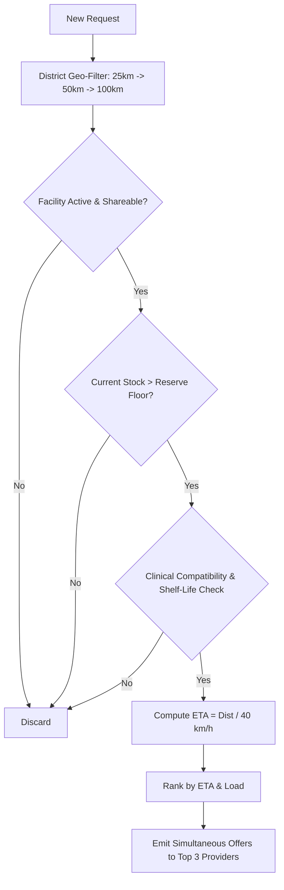

# LifeLink Mathematical & Clinical Algorithms

This document provides a formal mathematical and algorithmic reference for the core engines in LifeLink:
1. **Urgency-Based Prioritization Engine (§5.1)**
2. **Provider Matching & Reserve Floors (§5.2)**
3. **Clinical Blood Compatibility & FEFO Wastage Prevention (§5.3)**
4. **Lightweight Demand Forecasting Engine (§5.4)**
5. **Geodesic Distance & Transit Routing (§5.4b)**

---

## 1. Urgency Prioritization Engine (§5.1)

### 1.1 Objective & Rationale
Traditional healthcare dispatching relies on first-come-first-served (FCFS) queues. During acute regional surges (e.g., mass casualties, epidemic spikes), FCFS leads to preventable mortality when stable cases monopolize scarce life-support equipment. LifeLink replaces FCFS with a deterministic, fully explainable priority score $\mathcal{P} \in [0, 100]$.

### 1.2 Mathematical Formulation
The priority score is computed as a weighted linear combination of five normalized sub-scores:

$$\mathcal{P} = w_c \cdot \mathcal{S}_{\text{crit}} + w_t \cdot \mathcal{S}_{\text{time}} + w_d \cdot \mathcal{S}_{\text{dist}} + w_s \cdot \mathcal{S}_{\text{scarcity}} + w_a \cdot \mathcal{S}_{\text{age}}$$

#### Default Weights:
- $w_c = 0.45$ (Patient Criticality Weight)
- $w_t = 0.25$ (Time-Sensitivity Window Weight)
- $w_d = 0.10$ (Proximity / Delivery Feasibility Weight)
- $w_s = 0.10$ (Network Scarcity Weight)
- $w_a = 0.10$ (Anti-Starvation Age Bonus Weight)
- Constraint: $\sum w_i = 1.0$

```
+-----------------------------------------------------------------------------+
|                     Urgency Prioritization Weights                          |
+-----------------------------------------------------------------------------+
| [■■■■■■■■■■■■■■■■■■■■■■■] Criticality (45%)                                 |
| [■■■■■■■■■■■■■] Time-Sensitivity (25%)                                      |
| [■■■■■] Proximity (10%)                                                     |
| [■■■■■] Scarcity (10%)                                                      |
| [■■■■■] Age Bonus (10%)                                                     |
+-----------------------------------------------------------------------------+
```

### 1.3 Component Formulations

#### 1. Patient Criticality Score ($\mathcal{S}_{\text{crit}}$)
Directly maps the clinician's evaluated emergency severity index ($C \in [1, 5]$):

$$\mathcal{S}_{\text{crit}} = \left(\frac{C}{5}\right) \times 100$$

- $C = 5$ (Life-threatening / Arrest / Severe Hypoxia $\text{SpO}_2 < 80\%$): $\mathcal{S}_{\text{crit}} = 100$
- $C = 1$ (Stable / Elective support): $\mathcal{S}_{\text{crit}} = 20$

#### 2. Time Sensitivity Score ($\mathcal{S}_{\text{time}}$)
Measures the urgency window relative to the 4-hour horizon ($240\text{ minutes}$):

$$\mathcal{S}_{\text{time}} = \begin{cases}
100 & \text{if } \Delta t_{\text{needed}} \le 0 \text{ (Overdue)} \\
\text{clamp}\left(1 - \frac{\Delta t_{\text{needed}}}{240}, 0, 1\right) \times 100 & \text{if } \Delta t_{\text{needed}} > 0
\end{cases}$$

Where $\Delta t_{\text{needed}} = \frac{T_{\text{neededBy}} - T_{\text{now}}}{60 \times 1000}$ minutes.

#### 3. Proximity Feasibility Score ($\mathcal{S}_{\text{dist}}$)
Rewards proximity to available supply. Closer providers can fulfill faster:

$$\mathcal{S}_{\text{dist}} = \text{clamp}\left(1 - \frac{D_{\text{km}}}{100}, 0, 1\right) \times 100$$

Where $D_{\text{km}}$ is the road/geodesic distance to the nearest viable provider (capped at $100\text{ km}$).

#### 4. Network Scarcity Score ($\mathcal{S}_{\text{scarcity}}$)
Reflects regional supply depletion. If few units remain across the entire district mesh, requests compete for scarce stock:

$$\mathcal{S}_{\text{scarcity}} = \text{clamp}\left(1 - \frac{U_{\text{avail}}}{\max(Q_{\text{req}} \times 3, 1)}, 0, 1\right) \times 100$$

Where $U_{\text{avail}}$ is total shareable units network-wide, and $Q_{\text{req}}$ is the requested quantity.

#### 5. Anti-Starvation Age Bonus ($\mathcal{S}_{\text{age}}$)
Prevents moderate requests from languishing indefinitely when repeated higher-priority requests arrive:

$$\mathcal{S}_{\text{age}} = \min\left(\frac{\Delta t_{\text{waiting}}}{60}, 1\right) \times 100$$

Where $\Delta t_{\text{waiting}}$ is minutes elapsed since initial broadcast. At 60 minutes, the request receives the maximum $+10$ point boost.

### 1.4 Dynamic Weight Tuning & Explainability
- Health authorities (`STATE_ADMIN`) can tune the weights through the admin portal (`PUT /api/v1/admin/priority-weights`) to adapt to localized disasters (e.g. increasing proximity weight during monsoon road washouts).
- Every score calculation generates an immutable `scoreBreakdown` JSON saved directly to the database for full clinical auditability.

---

## 2. Provider Matching Engine (§5.2)

When an emergency request is generated, candidate provider facilities are identified through a multi-step filter:



### 2.1 Step-Radius Expansion
To minimize transport delays and cross-district bureaucracy:
1. **Tier 1:** Intra-district search within $25\text{ km}$.
2. **Tier 2:** Intra-district search expanded to $50\text{ km}$.
3. **Tier 3:** Cross-district search expanded up to $100\text{ km}$.

### 2.2 Reserve Floor Protection
Healthcare facilities must never be depleted to zero, which would imperil their own local inpatients.
- Each facility defines `reserveFloors`:
  $$\text{Available to Share} = \max(0, \text{Stock}_{\text{on-hand}} - \text{Reserve Floor})$$
- Example: If CHC Murbad has 3 oxygen concentrators and a reserve floor of 1, it will offer at most 2 units for external borrow requests.

### 2.3 Contention Resolution & First-to-Accept Protocol
1. LifeLink broadcasts offers simultaneously to the top 3 ranked provider facilities.
2. **Offer Expiration:**
   - Criticality $\ge 4$: 10-minute expiration window.
   - Criticality $< 4$: 30-minute expiration window.
3. The first provider to accept wins the allocation (`POST /api/v1/offers/:id/accept`).
4. Competing offers for that request are immediately cancelled, and unused units at other providers are unlocked for subsequent requests.

---

## 3. Clinical Blood Compatibility & FEFO Rules (§5.3)

### 3.1 Transfusion Compatibility Rules
LifeLink strictly adheres to DGHS/NACO (National AIDS Control Organisation, India) and AABB transfusion standards:

#### A. Red Blood Cells (PRBC & WHOLE)
Donor red cells must not possess antigens to which recipient serum has antibodies:
- **$O^-$:** Universal red cell donor.
- **$AB^+$:** Universal red cell recipient.

$$\text{RBC Compatibility Matrix}$$
| Recipient Group | Permitted Donor Groups |
|---|---|
| **$O^-$** | $O^-$ |
| **$O^+$** | $O^+$, $O^-$ |
| **$A^-$** | $A^-$, $O^-$ |
| **$A^+$** | $A^+$, $A^-$, $O^+$, $O^-$ |
| **$B^-$** | $B^-$, $O^-$ |
| **$B^+$** | $B^+$, $B^-$, $O^+$, $O^-$ |
| **$AB^-$** | $AB^-$, $A^-$, $B^-$, $O^-$ |
| **$AB^+$** | All 8 Blood Groups (Universal Recipient) |

#### B. Fresh Frozen Plasma (FFP / PLASMA)
> [!IMPORTANT]
> **Inverse of Red Cell Compatibility:** Plasma contains antibodies, not red cells.
> - **$AB$ Plasma:** Universal donor (contains neither anti-A nor anti-B antibodies).
> - **$O$ Plasma:** Contains both anti-A and anti-B antibodies; can only be administered to group $O$ recipients.

$$\text{Plasma Compatibility Matrix}$$
| Recipient Group | Permitted Donor Groups |
|---|---|
| **$AB$** | $AB$ only |
| **$A$** | $A$, $AB$ |
| **$B$** | $B$, $AB$ |
| **$O$** | $O$, $A$, $B$, $AB$ (Universal Recipient) |

### 3.2 FEFO (First-Expired, First-Out) with Transit Safety Margin
Standard inventory systems risk dispatching blood that expires while in transit or before transfusion can complete. LifeLink enforces a mandatory clinical transit buffer:

$$\Delta t_{\text{shelf-life}} = T_{\text{expiresAt}} - T_{\text{now}} > \text{ETA}_{\text{transit}} + 6\text{ hours}$$

- If shelf life $< \text{ETA} + 6\text{h}$, the unit is skipped to avoid dangerous en-route spoilage.
- Among viable compatible units, the unit with the **minimum remaining shelf life** is selected first (FEFO).

### 3.3 Automated 72-Hour Expiry Sweep & Redistribution
Every 15 minutes, a background cron sweep executes:
1. Marks any units with $T_{\text{expiresAt}} \le T_{\text{now}}$ as `EXPIRED`.
2. Scans for units with $T_{\text{expiresAt}} - T_{\text{now}} \le 72\text{ hours}$ in facilities with low local drawdown.
3. Automatically queries the district for open requests or high-consumption blood centres for the same group.
4. Generates proactive **Redistribution Suggestions** to transfer near-expiry units, reducing district-wide wastage.

---

## 4. Lightweight Demand Forecasting (§5.4)

Rural healthcare centers lack machine-learning infrastructure or GPUs. LifeLink provides robust, lightweight time-series forecasting using pure algebraic and statistical formulas running in Node.js.

```
Demand Series: [History (90 days)] ---> [SMA7 & SMA30] 
                                   ---> [Seasonality Index S(d)] ---> Forecast D(t)
                                   ---> [Trend Slope (14d)] 
```

### 4.1 7-Day & 30-Day Simple Moving Averages
$$\text{SMA}_k(t) = \frac{1}{k} \sum_{i=0}^{k-1} D_{t-i}$$

Where $D_{t-i}$ is the observed demand on day $t-i$.

### 4.2 Day-of-Week Seasonality Index ($S_d$)
Rural health centers experience pronounced weekday seasonality (e.g. weekly market days drive OPD surges, while Sundays have lower elective activity):

$$S_d = \frac{\bar{D}_{\text{weekday } d}}{\bar{D}_{\text{overall}}}$$

Where:
- $\bar{D}_{\text{weekday } d}$ is the average demand on day-of-week $d \in \{0, \dots, 6\}$ over the past 8 weeks.
- $\bar{D}_{\text{overall}}$ is the global mean daily demand over the same period.

### 4.3 14-Day Linear Trend Slope ($\beta$)
Computed via ordinary least squares regression over the last 14 days ($n = 14$):

$$\beta = \frac{n \sum_{i=1}^n x_i y_i - \left(\sum_{i=1}^n x_i\right)\left(\sum_{i=1}^n y_i\right)}{n \sum_{i=1}^n x_i^2 - \left(\sum_{i=1}^n x_i\right)^2}$$

### 4.4 Composite Forecast Formula
The expected demand $h$ days into the future is projected as:

$$\hat{D}(h) = \max\left(0, \; \text{SMA}_7 \cdot S_{\text{weekday}(t+h)} + \beta \cdot h\right)$$

### 4.5 Forecast Uncertainty & Proactive Surge Alerting
- **Confidence Metric:** Derived from the coefficient of variation ($c_v = \frac{\sigma}{\mu}$) of the historical demand series:
  $$\text{Confidence} = \text{clamp}(1 - c_v, 0.4, 0.95)$$
- **Surge Alert Trigger:**
  A `ForecastAlert` is generated when predicted 3-day demand exceeds 80% of current available stock:
  $$\sum_{h=1}^3 \hat{D}(h) > 0.8 \cdot \text{Stock}_{\text{available}}$$
  Alert message format:
  > *"PHC Kalyan expects ~4 oxygen concentrator requests in the next 3 days; you have 2 available. Consider pre-positioning from CHC Murbad."*

---

## 5. Geodesic Distance & Transit Routing (§5.4b)

### 5.1 Haversine Distance Formula
Computes the great-circle distance between two latitude/longitude points on Earth:

$$a = \sin^2\left(\frac{\Delta \phi}{2}\right) + \cos(\phi_1) \cdot \cos(\phi_2) \cdot \sin^2\left(\frac{\Delta \lambda}{2}\right)$$
$$c = 2 \cdot \text{atan2}\left(\sqrt{a}, \sqrt{1-a}\right)$$
$$d = R \cdot c$$

Where:
- $R = 6371\text{ km}$ (Mean radius of Earth)
- $\phi_1, \phi_2$ are latitudes in radians
- $\Delta \phi = \phi_2 - \phi_1$, $\Delta \lambda = \lambda_2 - \lambda_1$

### 5.2 Road Network ETA Heuristic
Because rural Indian terrain includes single-lane state highways, ghat sections, and rural roads, straight-line distance is adjusted by a rural circuity factor ($1.25$) and average transit speed:

$$\text{ETA}_{\text{mins}} = \text{round}\left(\frac{D_{\text{km}} \times 1.25}{v_{\text{road}}} \times 60\right)$$

- Default road speed $v_{\text{road}} = 40\text{ km/h}$.
- This shared calculation runs identically in Node.js backend services and client-side offline caches.
