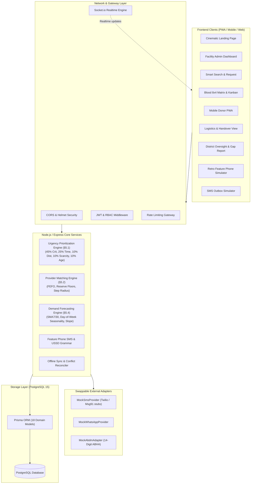

# LifeLink Architecture & System Design

LifeLink is an end-to-end, real-time, low-bandwidth inventory-sharing platform designed for rural public health ecosystems in India.

## System Architecture Diagram

## Real-Time WebSocket Event Matrix

| Event | Room | Payload | Trigger |
|---|---|---|---|
| `inventory:changed` | `facility:{id}` | `{ facilityId, typeCode, action, unit }` | One-tap +/- stepper, status toggle, intake |
| `request:created` | Global / `district:{id}` | `{ request, offers }` | New urgent loan request broadcast |
| `queue:updated` | Global | `{ queue: Request[] }` | 60s periodic re-rank, surge, status changes |
| `offer:received` | `facility:{id}` | `{ offerId, requestId, etaMins, expiresAt }` | Provider matching finds candidate donor |
| `offer:resolved` | `facility:{id}` | `{ offer, request, allocation, pickupJob }` | Provider accepts loan offer |
| `pledge:created` | `facility:{id}` | `{ requestId, donorName, bloodGroup }` | Donor pledges unit on mobile PWA |
| `blood:expiry_sweep` | Global | `{ expiredCount, redistributionSuggestions }` | 72h FEFO automated watch scan |
| `logistics:updated` | Global | `{ job: LogisticsJob }` | Transport driver status advance |
| `surge:triggered` | Global | `{ count }` | Live surge re-ranking simulation |
